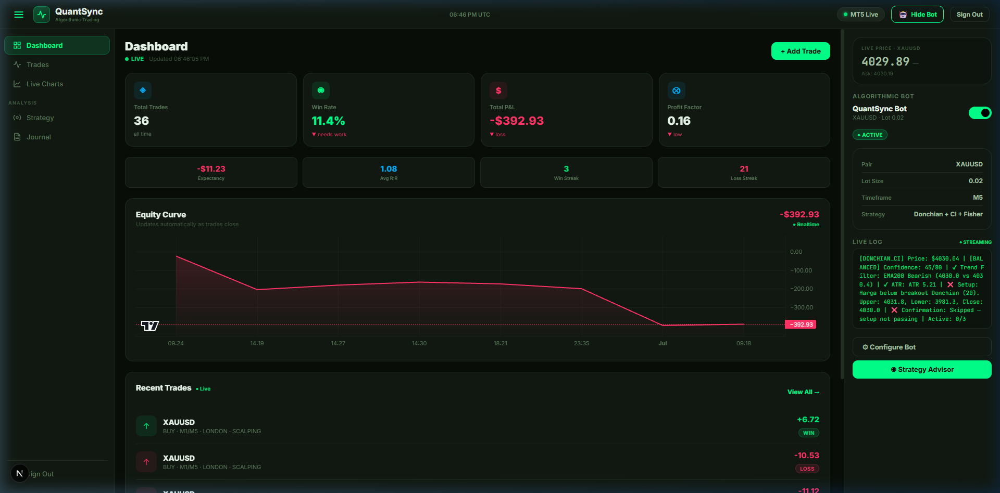
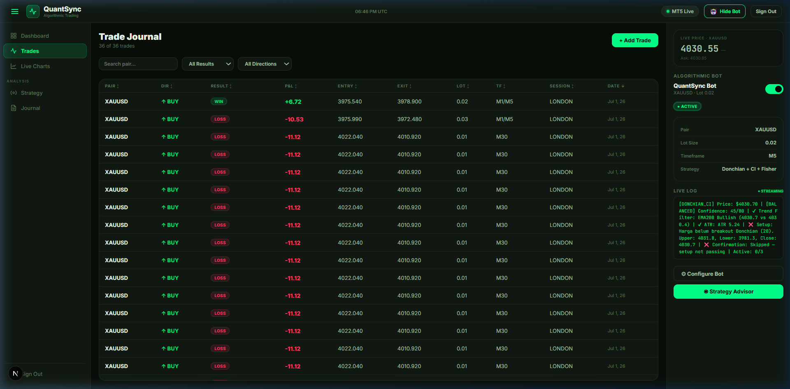
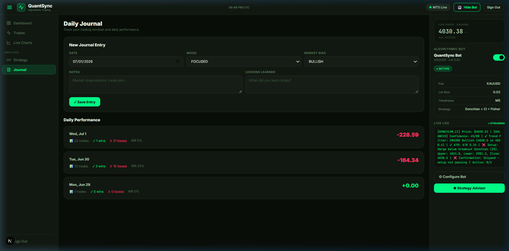
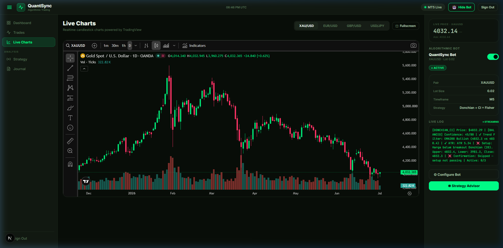
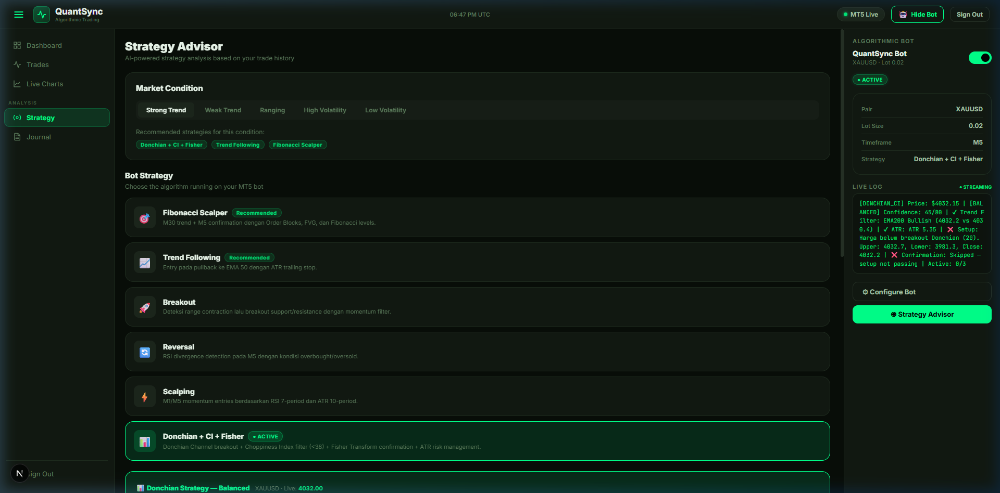

# Portofolio Proyek: QuantSync — Algorithmic Trading Journal & Automation Ecosystem

**QuantSync** adalah sebuah ekosistem trading terintegrasi yang menggabungkan kekuatan **otomatisasi bot trading** dengan **analisis jurnal trading berbasis web secara real-time**. Dirancang khusus untuk trader yang menerapkan metode *Smart Money Concepts* (SMC), aplikasi ini menjembatani aktivitas eksekusi algoritma di terminal trading (MetaTrader 5) dengan pencatatan analitis di cloud (Supabase).

Aplikasi ini sangat cocok untuk dimasukkan ke dalam portofolio Anda sebagai bukti keahlian dalam pengembangan aplikasi web modern (Next.js/React), integrasi database real-time (Supabase), visualisasi data finansial, dan pengembangan sistem trading otomatis (Node.js/Python/WebSockets).

---

## 🚀 Deskripsi Singkat Aplikasi

QuantSync memecahkan masalah klasik trader: **pencatatan jurnal yang manual dan tidak disiplin** serta **kesulitan melacak performa emosional & strategis secara objektif**. 

Sistem ini terdiri dari tiga komponen utama:
1. **Web Dashboard & Analytics (Next.js & Tailwind CSS)**: Antarmuka premium untuk memantau performa trading, jurnal harian, statistik strategi, dan grafik pertumbuhan ekuitas.
2. **Database Cloud & Real-time Bridge (Supabase)**: Pusat penyimpanan data trading, jurnal harian, dan konfigurasi bot dengan sinkronisasi instan menggunakan PostgreSQL dan WebSockets.
3. **Execution Bot (Node.js & Python MetaTrader 5 API)**: Bot otomatis yang mengeksekusi posisi di MT5 berdasarkan deteksi pola pasar SMC (BOS, Order Block, FVG, Fibonacci) dan langsung mencatat transaksi tersebut ke database tanpa intervensi manual.

---

## 🏆 Fitur Ungkapan & Keunggulan Utama

*   **Pencatatan Otomatis (Automated Logging)**: Tidak ada lagi entri jurnal manual yang terlewat. Setiap transaksi yang dieksekusi di MT5 oleh bot atau trader secara otomatis terkirim dan tercatat di database jurnal web dalam hitungan milidetik.
*   **Analisis Psikologi & Emosi Trader**: Menyediakan fitur pelacakan emosi (misalnya keserakahan, kedisiplinan, kecemasan) di setiap trade untuk mengidentifikasi bias psikologis yang memengaruhi profitabilitas.
*   **Deteksi Pola Pasar SMC Terprogram**: Bot mampu mendeteksi *Break of Structure* (BOS), *Order Block* (OB), dan *Fair Value Gap* (FVG) secara real-time untuk akurasi entri yang tinggi.
*   **Manajemen Risiko Dinamis (ATR-Based)**: Pengaturan batas kerugian (*Stop Loss*) dan target keuntungan (*Take Profit*) dinamis yang dihitung otomatis berdasarkan volatilitas pasar terkini menggunakan indikator *Average True Range* (ATR).
*   **Proteksi Anti-Overtrading**: Batasan sistem yang mencegah bot membuka lebih dari 3-5 posisi aktif secara bersamaan guna menjaga rasio kecukupan margin dan menekan risiko kebangkrutan (*drawdown*).

---

## 📸 Dokumentasi Fitur & Antarmuka Aplikasi

Berikut adalah tangkapan layar (screenshot) dari setiap fitur utama QuantSync yang dapat Anda gunakan langsung untuk bahan portofolio:

### 1. Dashboard Utama (Real-Time Performance Overview)
Dashboard ini menyajikan ringkasan statistik performa trading secara langsung, termasuk statistik *Win Rate*, total profit/loss, jumlah perdagangan aktif, dan grafik performa mingguan/bulanan.

> [!NOTE]
> **Keunggulan Teknis**: Halaman ini melakukan kalkulasi metrik finansial secara dinamis (seperti Profit Factor dan Average Risk-to-Reward) langsung dari database Supabase menggunakan query teroptimasi.

---

### 2. Daftar Perdagangan (Trade List & History Manager)
Halaman ini menampilkan riwayat lengkap seluruh trade yang dilakukan (baik BUY maupun SELL), lengkap dengan detail posisi harga entri, SL, TP, hasil akhir (WIN/LOSS/BREAKEVEN/RUNNING), setup SMC yang digunakan, serta label emosi saat transaksi berlangsung.

> [!NOTE]
> **Keunggulan Teknis**: Dilengkapi dengan fitur filter multi-parameter (berdasarkan Pair, Arah, Sesi Pasar, Timeframe, dan Hasil) untuk mempermudah trader melakukan audit mendalam terhadap performa historis mereka.

---

### 3. Jurnal Harian & Evaluasi Psikologi (Daily Trading Journal)
Jurnal harian berbasis kalender yang memungkinkan trader mencatat bias pasar harian (Bullish/Bearish/Neutral), catatan evaluasi pasar, serta kondisi emosi/mood trader sepanjang hari tersebut.

> [!NOTE]
> **Keunggulan Teknis**: Membantu trader melacak korelasi antara kondisi psikologi (mood harian) dengan performa hasil trading, memberikan wawasan unik untuk menghindari trading saat kondisi psikologis kurang prima.

---

### 4. Analisis Visual & Charting (Interactive Performance Charts)
Fitur charting interaktif yang memvisualisasikan data transaksi ke dalam berbagai grafik analitik seperti kurva pertumbuhan ekuitas (*equity curve*), persentase distribusi sesi trading (London/New York/Asian), perbandingan win-loss, dan porsi setup SMC yang paling menguntungkan.

> [!NOTE]
> **Keunggulan Teknis**: Menggunakan library grafik modern (Recharts/Chart.js) untuk menyajikan data interaktif yang responsif, mulus, dan real-time sesuai dengan data historis di database.

---

### 5. Pengaturan Strategi & Bot (Strategy & Bot Settings)
Halaman kontrol untuk mengatur parameter bot trading secara dinamis. Trader dapat mengaktifkan/menonaktifkan bot, memilih strategi trading (misalnya SMC Breakout, OrderBlock Reversal), mengatur tingkat risiko per transaksi (% dari ekuitas), serta mengonfigurasi batas Stop Loss dan Take Profit berbasis ATR.

> [!NOTE]
> **Keunggulan Teknis**: Parameter yang diubah pada antarmuka web langsung disinkronkan ke database Supabase, yang kemudian dibaca oleh bot eksekusi (Node.js/Python) secara real-time tanpa perlu me-restart proses bot di server.

---

## 🛠️ Tech Stack & Arsitektur Sistem

Berikut rincian teknologi yang digunakan dalam proyek ini untuk memamerkan kapabilitas teknis Anda:

| Komponen | Teknologi | Deskripsi / Fungsi |
| :--- | :--- | :--- |
| **Frontend** | React, Next.js (App Router), Tailwind CSS, Recharts | Menyediakan antarmuka web modern, responsif, dan visualisasi data performa trading yang interaktif. |
| **Backend & DB** | Supabase (PostgreSQL), GoTrue (Auth), Row Level Security (RLS) | Database cloud dengan sinkronisasi real-time, pengelolaan sesi pengguna aman, dan proteksi data transaksi antar pengguna. |
| **Execution Bridge**| WebSockets, REST APIs, Node.js | Jembatan komunikasi data real-time untuk mengirimkan sinyal trading dan log transaksi dari MT5 ke database Supabase. |
| **Trading Engine** | Python, MetaTrader 5 API, Pandas, NumPy | Algoritma pemrosesan data pasar (market feed), deteksi pola SMC, dan eksekusi order transaksi langsung ke pasar. |
